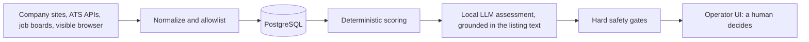
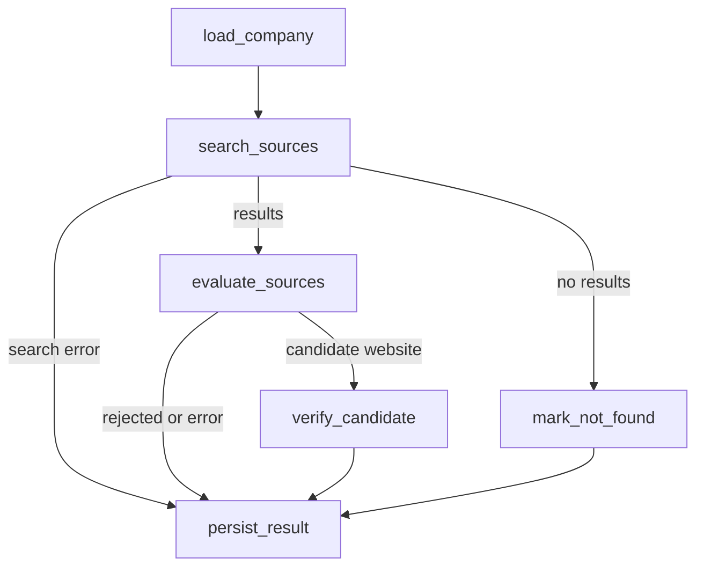

# career-agent


A local-first, security-hardened job-search assistant. It discovers companies and
open roles, verifies them against real sources, scores them against your profile
with an explainable rule engine refined by a **local** LLM, and keeps a human in
control of every decision. Nothing is applied to automatically.

> A personal portfolio project: single user, runs on `localhost` only. Built with
> AI-assisted development; the architecture, security requirements and review are
> mine, and the test suite is there to keep the generated code honest.

## What it does

- **Company discovery (LangGraph).** For each company: search, evaluate the results
  (strict rules first, a local Ollama model only as fallback), verify the candidate
  website with a hand-written SSRF-safe fetcher, then persist the result.
- **Job sources.** Public ATS boards (Greenhouse, Lever, Ashby and similar),
  search results from 12 job boards normalized through per-provider URL allowlists,
  and an open/closed audit of listings.
- **Visible-browser agent (Playwright + local LLM).** Collects listings from sites
  in a real, visible browser with fixed delays, cooldowns and a human hand-off for
  logins and verification pages. It never solves CAPTCHAs, never enters credentials
  and never submits applications.
- **Explainable scoring.** A deterministic 0-100 engine (`strong_apply`, `apply`,
  `review`, `skip`) is always the base. A local `qwen3:8b` model may refine it, but
  only from evidence quoted from the listing, and hard gates can override it.
- **CV import.** Builds a draft profile with a local model; e-mail addresses,
  phone numbers, URLs and similar identifiers are redacted before the text reaches
  the model.
- **Operator UI (React + TypeScript).** Review queue, company browser, application
  tracker with status history.

## Architecture



The company-discovery graph (`backend/app/discovery/graph.py`):



## Engineering decisions worth reading

1. **Never trust LLM output on its own.** Every URL a model returns must come from
   the actual search results; quoted evidence must appear verbatim in the listing;
   a company only becomes `verified` after the site was really fetched and the
   legal name was found on it. Prompt rules are backed by code checks
   (`discovery/evaluator.py`, `local_job_agent.py`).
2. **SSRF-safe fetching, written by hand** (`discovery/web_verifier.py`). DNS is
   resolved first and every address must be globally routable, TLS connects to the
   resolved IP with SNI, redirects must stay on the same site over HTTPS (max 3),
   content types are allowlisted and response size is capped.
3. **Deterministic first, LLM second.** The rule engine's score is never bypassed.
   A closed listing is forced to `skip`, and the model cannot upgrade a listing
   whose activity is unverified.
4. **Invariants live in the database too.** CHECK constraints (for example
   `verified` requires a website and a timestamp), upserts guarded by
   `WHERE status <> 'verified'` so a good record is not downgraded, soft dismissals
   instead of deletes, and a least-privilege runtime DB role separate from the
   migration role.
5. **Agentic browser control with code-level allowlisting.** The model only sees
   pre-vetted page controls, element ids are session-local, text fields can only be
   filled with values approved server-side, every action is checked again at
   execution time, and navigation away from the origin is rejected.
6. **LangGraph used deliberately.** Graph state is serializable; the live browser
   page stays outside it (`backend/app/browser_access_graph.py`), loops are bounded,
   and tool execution is custom instead of a generic prebuilt executor.
7. **Hardened local API.** The operator API is off unless a token is configured,
   tokens are compared in constant time, hosts are restricted to loopback, CORS is
   narrow, security headers are set, and expensive actions are rate limited.

## Quick start

Requirements: Docker, Python 3.14, Node 24, and (for the LLM features) Ollama with
`qwen3:8b`.

```bash
git clone https://github.com/Asli-nur-t/career-agent.git
cd career-agent
cp .env.example .env   # then fill in the empty values
```

Generate strong values for `POSTGRES_PASSWORD`, `APP_DB_PASSWORD` and
`OPERATOR_API_TOKEN`:

```bash
python -c 'import secrets; print(secrets.token_urlsafe(32))'
```

Backend:

```bash
python -m venv .venv && source .venv/bin/activate
python -m pip install -r backend/requirements.txt
docker compose up -d db
PYTHONPATH=backend python -m alembic upgrade head
PYTHONPATH=backend python -m uvicorn app.main:app --host 127.0.0.1 --port 8000
```

UI (second terminal):

```bash
cd frontend && npm ci && npm run dev   # http://127.0.0.1:5173
```

Optional local model: `ollama pull qwen3:8b`. Web search needs a `SERPER_API_KEY`.
Detailed usage (Turkish): [docs/KULLANIM.tr.md](docs/KULLANIM.tr.md).

## Tests

```bash
python -m pip install -r backend/requirements-dev.txt
python -m pytest
```

290+ tests. CI runs the frontend type-check and build plus pytest with coverage;
GitHub Actions are pinned to commit SHAs and run with read-only permissions.

## Responsible use

The browser agent works in a visible browser with your own session, uses fixed
delays, never bypasses logins, CAPTCHAs or blocks, and stops a source for hours
once a block is detected. Many job sites restrict automated access in their terms,
so read them before enabling a source; individual sources can be switched off with
`BROWSER_AGENT_DISABLED_PROVIDERS`. You are responsible for how you use it. Personal
data (CV, profile, browser profile, `.env`) is git-ignored and stays on your machine.

## Possible next steps

- Move the browser filter-filling loop to LangGraph with the same safety checks.
- A persistent worker so a paused human hand-off can resume across restarts.
- An agent-security evaluation harness built on the existing guardrails.

## License

MIT, see [LICENSE](LICENSE).
